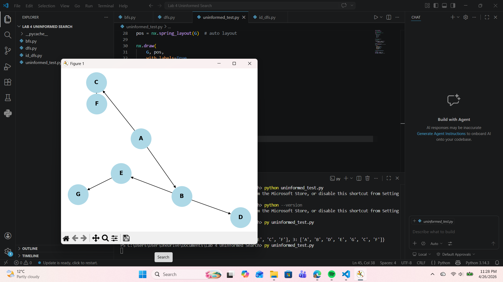
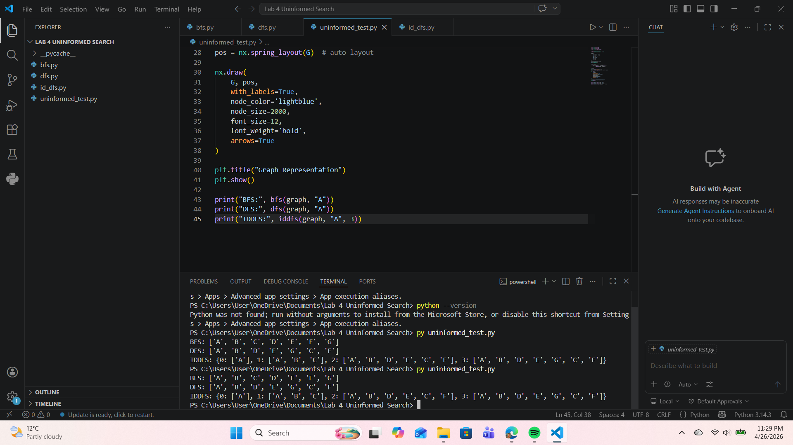

# Uninformed Search Algorithms

This project demonstrates the implementation of fundamental uninformed search algorithms in Python:

* Breadth-First Search (BFS)
* Depth-First Search (DFS)
* Iterative Deepening Depth-First Search (IDDFS)

## Description

The algorithms are applied on a graph structure consisting of nodes A to G.
All traversals begin from node **A**.

## Output

The program prints the traversal order for each algorithm.

### Example Output

```
BFS: ['A', 'B', 'C', 'D', 'E', 'F', 'G']
DFS: ['A', 'B', 'D', 'E', 'G', 'C', 'F']
IDDFS: {0: ['A'], 1: ['A', 'B', 'C'], 2: ['A', 'B', 'D', 'E', 'C', 'F'], 3: ['A', 'B', 'D', 'E', 'G', 'C', 'F']}
```

## Graph Visualization



## Program Output



## How to Run

```bash
py uninformed_test.py
```

## Technologies Used

* Python
* NetworkX
* Matplotlib

